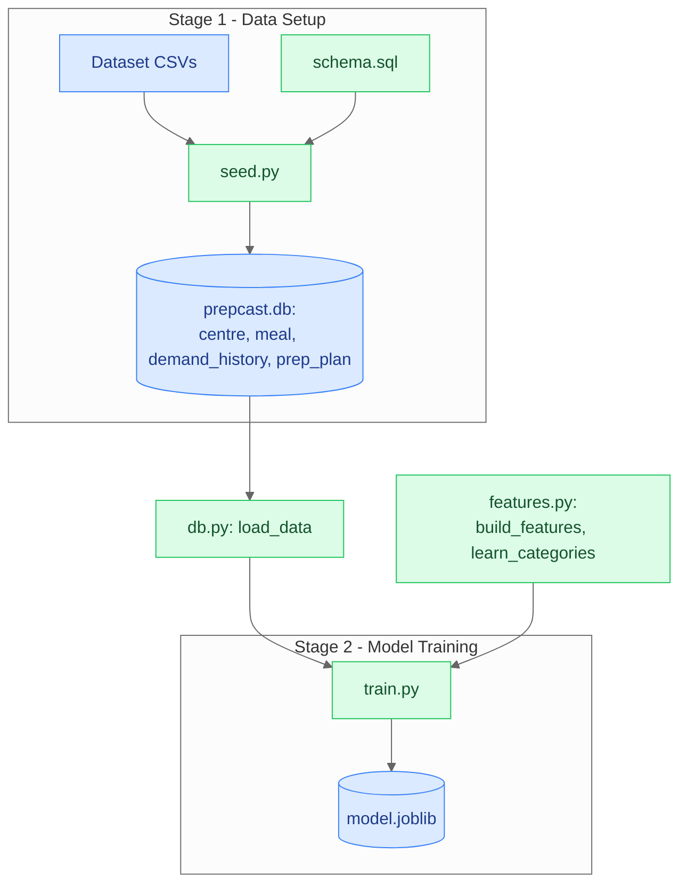

```mermaid
%%{init: {'theme': 'neutral'}}%%
flowchart TD
    subgraph S1[Stage 1 - Data Setup]
        CSV[Dataset CSVs] --> SEED[seed.py]
        SCHEMA[schema.sql] --> SEED
        SEED --> DB[(prepcast.db:<br/>centre, meal, demand_history, prep_plan)]
    end

    DBPY[db.py: load_data]
    FEAT[features.py:<br/>build_features, learn_categories]

    subgraph S2[Stage 2 - Model Training]
        TRAIN[train.py] --> MODEL[(model.joblib)]
    end

    DB --> DBPY
    DBPY --> TRAIN
    FEAT --> TRAIN

    classDef store fill:#dbeafe,stroke:#3b82f6,color:#1e3a8a;
    classDef code  fill:#dcfce7,stroke:#22c55e,color:#14532d;

    class DB,MODEL,CSV store;
    class SEED,SCHEMA,TRAIN,DBPY,FEAT code;
```
