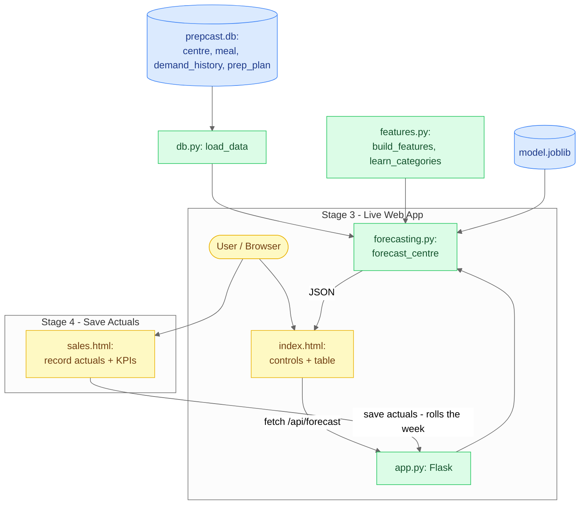

```mermaid
%%{init: {'theme': 'neutral'}}%%
flowchart TD
    MODEL[(model.joblib)]
    DB[(prepcast.db:<br/>centre, meal, demand_history, prep_plan)]
    DBPY[db.py: load_data]
    FEAT[features.py:<br/>build_features, learn_categories]

    subgraph S3[Stage 3 - Live Web App]
        USER([User / Browser]) --> HTML[index.html:<br/>controls + table]
        HTML -->|fetch /api/forecast| APP[app.py: Flask]
        APP --> FC[forecasting.py:<br/>forecast_centre]
        FC -->|JSON| HTML
    end
    subgraph S4[Stage 4 - Save Actuals]
        SALES[sales.html:<br/>record actuals + KPIs]
    end

    DB --> DBPY
    DBPY --> FC
    FEAT --> FC
    MODEL --> FC

    USER --> SALES
    SALES -->|save actuals - rolls the week| APP

    classDef store fill:#dbeafe,stroke:#3b82f6,color:#1e3a8a;
    classDef code  fill:#dcfce7,stroke:#22c55e,color:#14532d;
    classDef ui    fill:#fef9c3,stroke:#eab308,color:#713f12;

    class DB,MODEL store;
    class FC,APP,DBPY,FEAT code;
    class USER,HTML,SALES ui;
```
