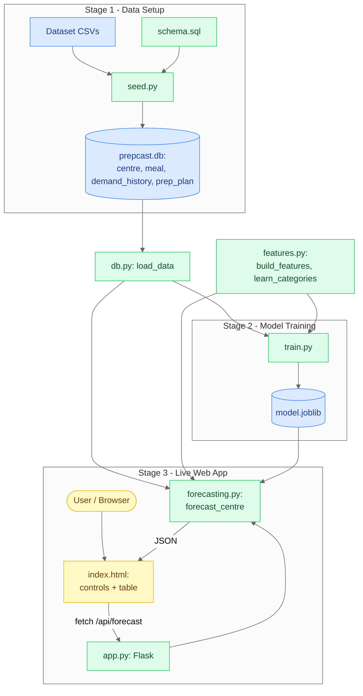

```mermaid
%%{init: {'theme': 'neutral'}}%%
flowchart TD
DBPY[db.py: load_data]
FEAT[features.py:<br/>build_features, learn_categories]

    subgraph S1[Stage 1 - Data Setup]
        CSV[Dataset CSVs] --> SEED[seed.py]
        SCHEMA[schema.sql] --> SEED
        SEED --> DB[(prepcast.db:<br/>centre, meal, demand_history, prep_plan)]
    end
    subgraph S2[Stage 2 - Model Training]
        TRAIN[train.py] --> MODEL[(model.joblib)]
    end
    subgraph S3[Stage 3 - Live Web App]
        USER([User / Browser]) --> HTML[index.html:<br/>controls + table]
        HTML -->|fetch /api/forecast| APP[app.py: Flask]
        APP --> FC[forecasting.py:<br/>forecast_centre]
        FC -->|JSON| HTML
    end

    DB --> DBPY
    DBPY --> TRAIN
    FEAT --> TRAIN
    DBPY --> FC
    FEAT --> FC
    MODEL --> FC

    classDef store fill:#dbeafe,stroke:#3b82f6,color:#1e3a8a;
    classDef code  fill:#dcfce7,stroke:#22c55e,color:#14532d;
    classDef ui    fill:#fef9c3,stroke:#eab308,color:#713f12;

    class DB,MODEL,CSV store;
    class SEED,SCHEMA,TRAIN,FC,APP,DBPY,FEAT code;
    class USER,HTML ui;

```

```

```
